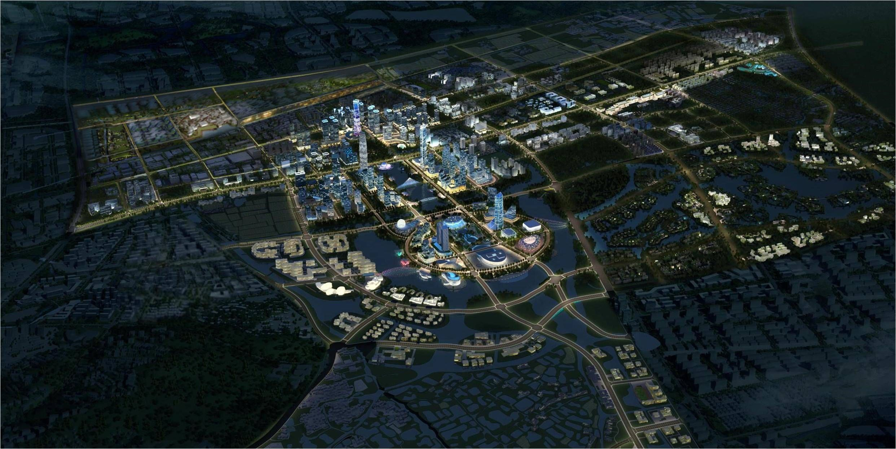
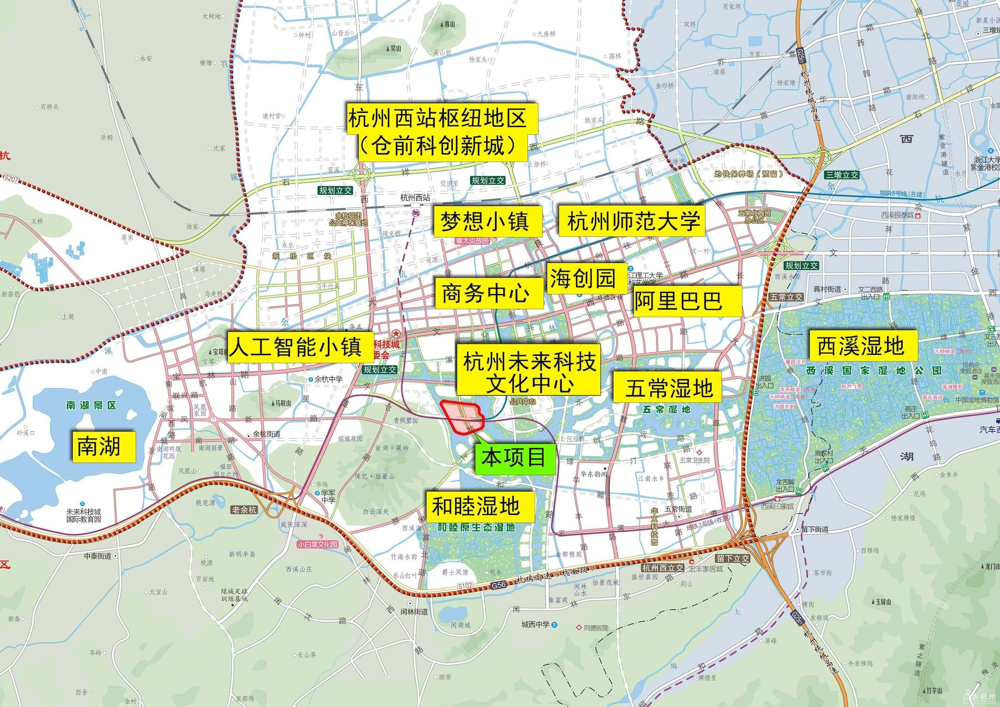
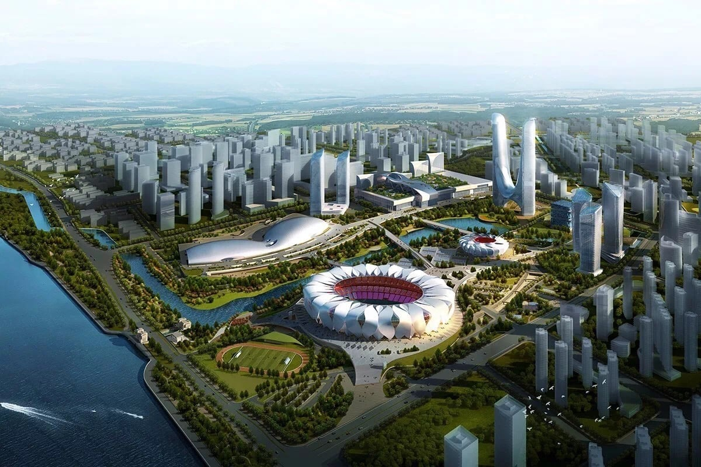
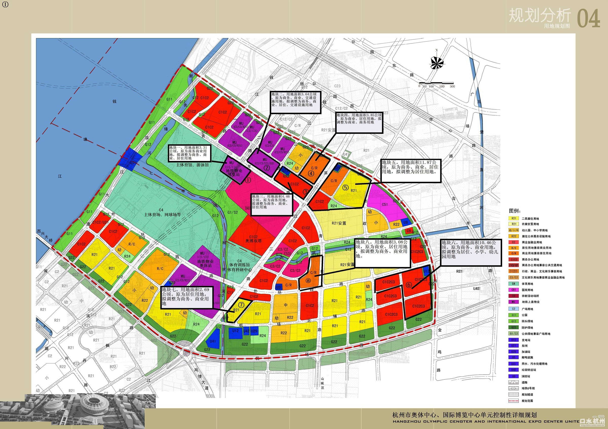
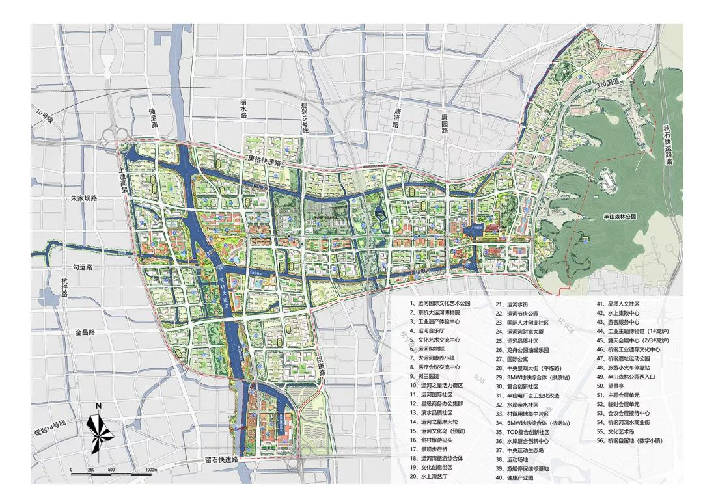
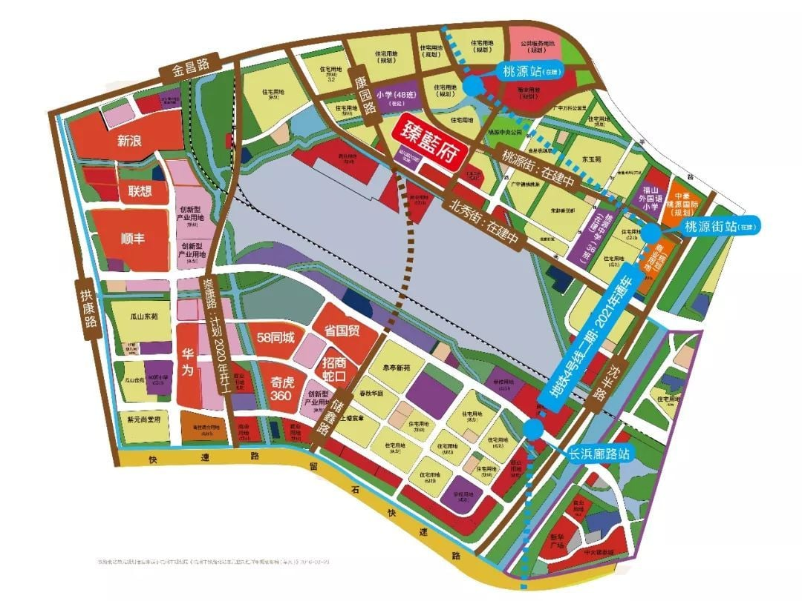
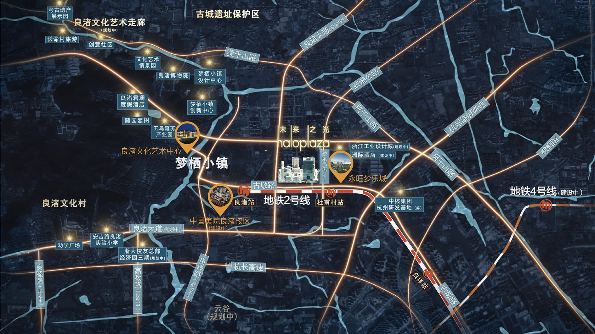
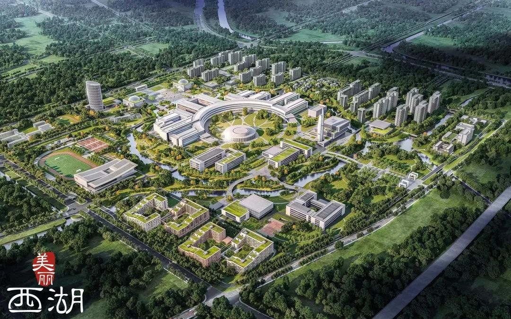
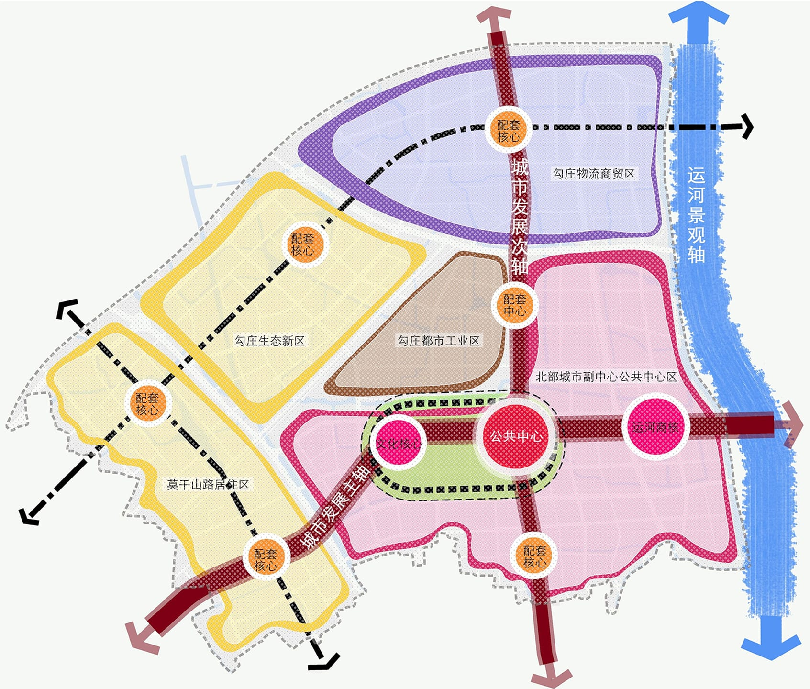
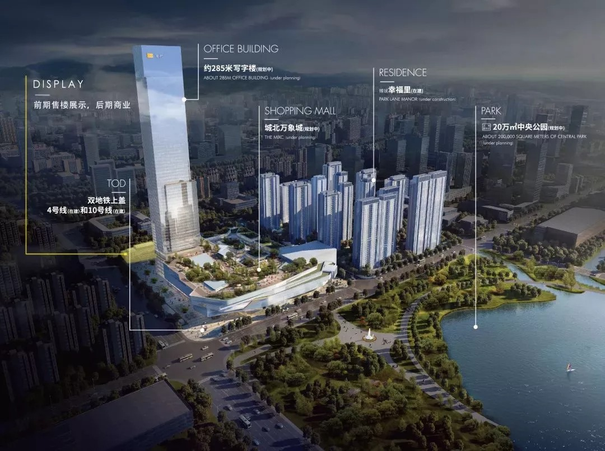

# 板块

<Adsense :data-ad-client=$themeConfig.ads.client :data-ad-slot=$themeConfig.ads.slot is-new-ads-code="yes" class="side-ads"></Adsense>

这个单元将着重对杭州购房几个热门板块进行介绍，并主观上分析它们的优势和劣势。

## 未来科技城

:::tip 参考
新房限价：37,700 元/平  
二手房价格：45,000 ~ 70,000 元/平  
适合人群：有无房资格且社保月数多的新房购房者；预算充足的二手房购房者  
:::

如果给杭州热门板块进行排名，未来科技城绝对可以排在前二甚至第一。

该板块位于余杭区西部，是由中组部、国资办确定的全国四个未来科技城之一（另三个分别在北京、天津、武汉），并被浙江省定位为高端人才集聚区、自主创新示范区和科学发展新城区。

阿里巴巴全球总部坐落于此，还包含海创园、欧美金融城、梦想小镇等高新技术集群，大量独角兽公司已经入驻，OPPO 和 VIVO 也确定在此设立总部。

总规划面积113平方公里，其中海创园一期附近35平方公里被定为重点建设区，向西至南湖还有未来科技城2.0规划，目前已落成菜鸟集团总部、阿里达摩院、人工智能小镇。

核心板块的中心是杭州市政府规划的公共中心，整个公共中心分成了六小块，分别设立市民中心、全民体育中心、科技文化中心、国际演艺中心、会议中心、会展中心，再加上华润竞拍到绿汀路TOD地块（下图绿色标识），很有可能规划一座万象城，一站式满足市民的生活需求，也补齐了板块“没有生活气息”的短板。

正是如此强大的规划背景下，导致该板块的二手房价格突飞猛进，目前的价格已经大幅预支了板块的潜力，核心区域成交价格已经6万起步。与新房不足4万的限价形成大幅倒挂，导致该板块所有新楼盘都是“社保巨子”拼抢密集区，并且供应量紧缺，因此如果没有无房资格或者社保月数不多，又不想买高价二手房，就不用关注这个板块了。

## 钱江世纪城

:::tip 参考
新房限价：48,200 元/平  
二手房价格：60,000 ~ 90,000 元/平  
适合人群：有无房资格且社保月数接近满额的新房购房者；预算极充足的二手房购房者  
:::

可以和未来科技城进行对抗的板块，只有钱江世纪城。

该板块位于萧山区的钱塘江南岸，与繁华的钱江新城隔岸相望，是浙江省政府、杭州市政府、萧山区政府共同建设的新金融中心、科创中心、城市新中心、中央商务区（CBD）、中央活动区（CAZ）。

这里是2016年G20峰会的举办地，2022年亚运会也将在这里的奥体中心举办。而作为CBD级别的规划，也吸引了诸如浙商产融、国信证券、中建投资、网易、商汤科技等大量金融与科技巨头入驻。生活方面，奥体印象城已经建成，近期高端商场项目 SKP 也落户于此，加上奥体中心的体育场馆在亚运会后也会转为民用。

虽然板块面积只有22平方公里，但是由于紧邻西靠滨江区，北望钱江新城，东临萧山科技城，南接萧山核心，并且仅凭现有配套就已经是高配置成熟板块。因此二手房也是突破天际的价位，并且豪宅遍地。这也让新盘限价呈现巨额的倒挂，买到就是几百万的收益，所以基本满社保月数才有资格入围摇号。

不过周围板块如市北、宁围这些板块无论价格和中签率都更平民一些，感兴趣可以考虑。

<InArticleAdsense :data-ad-client=$themeConfig.ads.client :data-ad-slot=$themeConfig.ads.inSlot is-new-ads-code="yes"></InArticleAdsense>

## 运河新城

:::tip 参考
新房限价：核心 38,000 元/平；外围 29,500 元/平  
二手房价格：40,000 ~ 50,000 元/平  
适合人群：400万预算者，轻度改善、需求学区房  
:::

运河新城位于城北拱墅区，留石高架以北的京杭大运河两岸，并向东延至半山。

实际上运河新城的规划可以追溯到2009年，当时的目标既定为打造城北副中心，然而确因未知原因搁置近十年。直到2018年杭州对运河新城重新规划，将已经停用的杭钢、炼油厂、电厂等工业旧址全部纳入规划范围，对板块进行大规模拆迁。

新规划将板块定位为文化中心、艺术中心，并且按照2019年国务院办公厅印发的[《长城、大运河、长征国家文化公园建设方案》](http://www.gov.cn/xinwen/2019-12/05/content_5458839.htm)，将着重打造大运河国家文化公园，规划了包括大运河公园、大运河博物馆、运河湾综合体等十大地标性建筑。

规划提出“运河之芯”计划，采取“一体两翼，内外圈层”的布局模式，将大城北发展重心重新聚焦、回归到运河两岸，紧紧围绕运河做文章，形成城北发展的统一合力。将杭州城北城市副中心在运河两岸落地，打造城北文化旅游中心、商业商务中心与智慧科创中心。

紧邻运河新城，环绕杭州北站，规划有一处高新产业园 ── 智慧网谷小镇，建成体量达250万平方米，目前已有顺丰、新浪、联想、华为等大型企业入驻。

可以看出，运河新城虽然定位不及未来科技城的高度，但是整拆整建让板块同样拥有了全新整体规划，板块中除了安置房都是可规划地块。而且规划侧重于文化层面，不再是遍地写字楼，发展前景未来可期。同时还能享受临近板块已经成熟的配套资源，加上拱墅区学区资源充足，相比未来科技城的从零发展来看，这个过渡要更平滑一些。

该板块其实在2020年初还不算热门，甚至被质疑限价过高，但随着规划一点点清晰，板块热度迅速攀升，并且由于整拆也没有什么二手房值得购买，购房需求都挤压在新房上。不过现阶段土地也供应不断，建议重点关注核心区域的新盘。

## 良渚

:::tip 参考
新房限价：29,100 元/平  
二手房价格：30,000 ~ 38,000 元/平  
适合人群：300万预算，城西刚需  
:::

良渚位于地铁2号线的尽头，属于余杭区，与西湖区三墩板块相邻。该板块实际属于官方划分的"良渚新城"，但由于良渚新城的范围太大（东至好运街），因此这里只讨论地铁2号线杜甫村和良渚站这部分区域。

之所以称为良渚，是因为这里是“良渚文化”的发源地，上世纪这里发现了距今五千年的[良渚古城遗址](https://zh.wikipedia.org/wiki/%E8%89%AF%E6%B8%9A%E9%81%97%E5%9D%80)。所以这里有得天独厚的文化保护区，附近有占地4万平方的良渚博物院，以及保留原始风貌的良渚文化村和梦栖小镇，也吸引了中国美术学院将新校区设立于此。

良渚板块的规划面积不大，主要规划大部分都已在建，在运营的商业配套有10万方的大型综合体"永旺梦乐城"。核心区域有“万科未来之光”在建，项目包括光剧院、大屋顶文化娱乐空间、无边际泳池、酒店娱乐空间、广场公园等高端配置配套，其中150米的“光之塔”将是良渚地标。另外还有暂未确定的被称为“良渚客厅”的良渚地铁站上盖项目，计划将集产业创新、会议交流、生活服务于一体，包含一幢160米地标，还包含10万方的商业项目。

在良渚的南部，则是杭州又一片高新技术产业区 ── 云谷，规划重点发展云计算大数据的核心技术及应用开发，里面拥有阿里云计算总部和菜鸟云谷园区，以及施一公教授创办的西湖大学。虽然目前也没有其他重点规划，云谷依然是大片荒地，但这就是良渚板块未来品质提升的潜力，云谷发展起来后相关配套也会被良渚享用，并且纵穿云谷向南可以快速到达未来科技城。

正如前面所说，良渚主要区域规划基本落成，所以新盘稀少，可以要多点耐心。

因此我推荐关注这个板块的优先考虑二手房，良渚二手房数量充足，价格相比其他热门板块不算夸张，大部分在 3~3.5 万/平左右，并且很多是 90 平以下的刚需小户型，如果总价预算只有 300 万的刚需，在这里还有一定选择空间。

<InArticleAdsense :data-ad-client=$themeConfig.ads.client :data-ad-slot=$themeConfig.ads.inSlot is-new-ads-code="yes"></InArticleAdsense>

## 北部新城/勾庄

:::tip 参考
新房限价：31,200元/平  
二手房价格：35,000 ~ 40,000 元/平  
适合人群：350万预算者，城北刚需  
:::

北部新城位于余杭区东北部，范围东至京杭大运河，南至拱墅区区界，西至西湖区区界，北至绕城高速公路。勾庄则是指原本的勾庄镇区域，现在大部分已经被拆迁，并划入北部新城范围，所以这里一并介绍。

该板块定位是杭州北部地区的公共服务、商业服务和文化交流中心，主要由智慧总部岛、科技创新岛、艺文水岸岛、会展时尚岛、绿色产业园区、知识产业园区、健康乐活街区等多个功能区域组成。

核心区域拥有杭北国际金融中心（上图24号位置）和城北万象城（上图8号位置）两座重量级商业建筑。杭北国际金融中心规划有330米主塔楼，以及多座100米以上的次塔楼。城北万象城作为杭州第二座万象城，处于地铁 4 号线和 10 号线交汇处，并且旁边规划有 20 万平方的湿地生态公园，导致万象城的住宅项目连续 3 次达成"万人摇"。

北部新城虽然如同运河新城一样，大部分区域还属于规划或在建状态，但就目前的规划来看，商业和文化配套都已经齐备，并且紧邻拱墅区也能享受一部分便捷。

目前新房也供应不断，虽然限价导致竞争较为激烈，但仍然推荐多关注这块区域。

二手房普遍是近几年刚交房，这里只推荐关注中心地段（因为边缘地段的配套目前几乎没有），价格目前都在 4 万/平左右，而且 90 平以下的小户型不多，所以总价预算需要达到 350 万以上。

## 闲林

:::tip 参考
新房限价：24,100 元/平  
二手房价格：24,000 ~ 40,000 元/平  
适合人群：250万预算者，未科刚需  
:::

闲林板块位于未来科技城板块南侧，理论上绿汀路以南一直到富阳区边界都应该算作闲林范围，这里只讨论靠近未来科技城这部分区域。

正是因为与未来科技城核心区域几公里的路程，但是价格只有其大约一半，让该板块成为未来科技城的刚需购房板块。

当然缺点也很明显，闲林配套规划严重缺乏，没有成熟的商业（综合体只有一座西溪欢乐城），没有能打的学区，整体面貌还处于城乡过渡阶段，规划上目前看也没有什么新突破。依山傍水的环境让闲林安逸静谧，但同样也制约了未来的发展潜力。

闲林新房也一直有供应，但并不多，所以摇号难度还是有的。二手房的房龄都比较老，所以价格也大部分在 3 万/平以下，次新盘价格则在 3 万/平 ~ 4 万/平之间。只有翡翠城是个例外，这个楼盘凭借 绿城品牌 + 靠近五常 + 3号线地铁口 + 靠近西溪欢乐城 这些因素加成，其价格一枝独秀，成为闲林天花板，价格均在 4 万/平左右。

如果在未来科技城工作，并且预算有限，可以考虑在闲林和良渚之间做选择。
