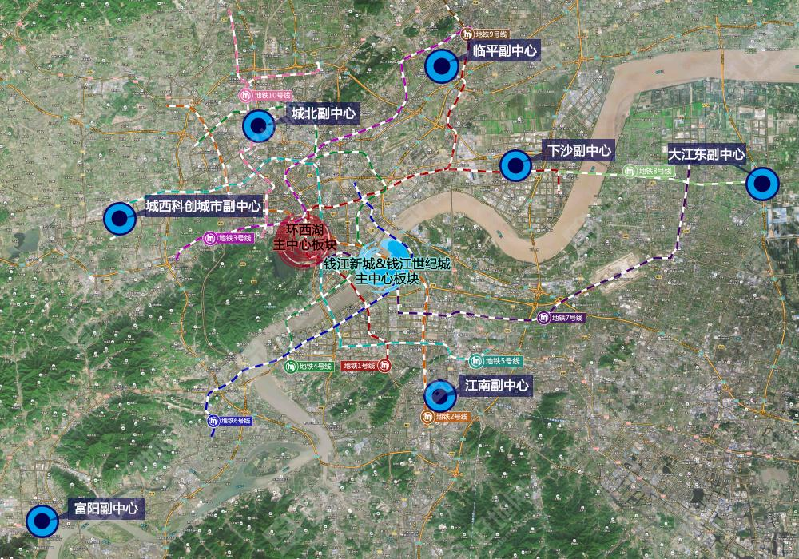
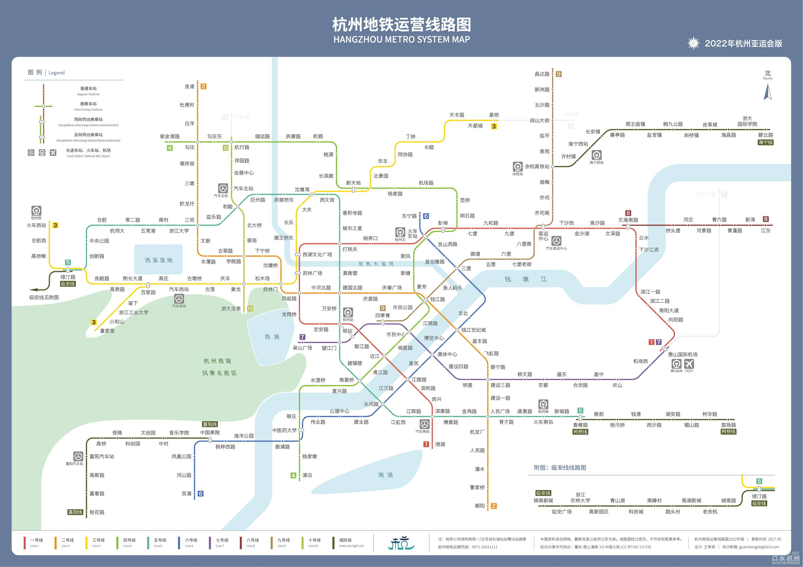
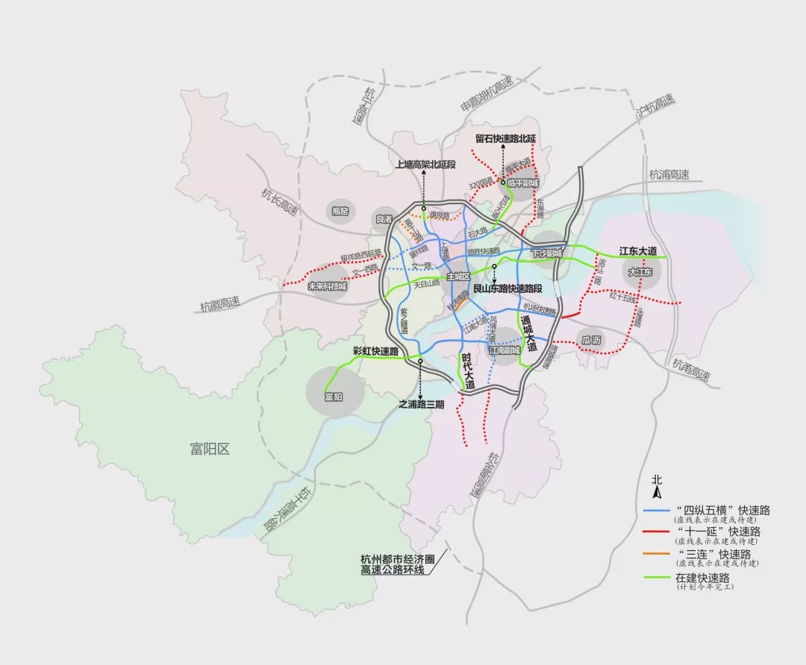
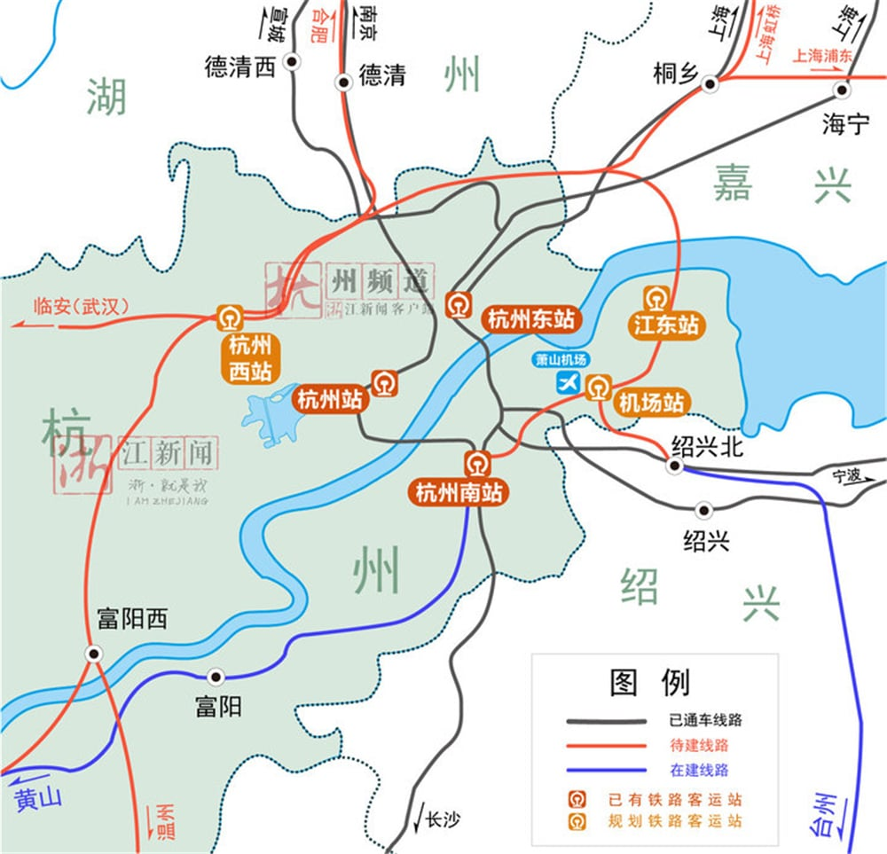

# 规划

<Adsense :data-ad-client=$themeConfig.ads.client :data-ad-slot=$themeConfig.ads.slot is-new-ads-code="yes" class="side-ads"></Adsense>

无论是购置新房还是二手房，都应该先了解杭州市区的规划，帮助我们选择更适合居住更有发展空间的地段。

## 城区规划

根据2016年发布的《杭州市楼宇经济发展“十三五”规划》，杭州市近几年的城市发展方向，主要以两个主中心和七个副中心的架构，每个中心都有明确的发展定位。

| 中心 | 区域范围 | 发展定位 |
| :----:| :----: | :----: |
| 环西湖主中心 | 西湖景区周边地区，包括庆春至凤起板块、武林板块、湖滨板块、吴山板块和黄龙板块 | 市级休闲游憩商业核心区（RBD），重点发展商贸流通、文化娱乐和休闲旅游等产业 |
| 钱江新城和钱江世纪城主中心| 由钱江新城和钱江世纪城两个区域组成 | 政治、经济、文化新中心和钱塘江金融港湾核心区，打造经济高度集聚、具有鲜明金融商贸特征的中央商务区 |
| 城北副中心| 以勾庄一带为核心，由运河新城、北部新城核心区组成，辐射良渚组团、瓶窑组团 | 以勾庄一带为核心，由运河新城、北部新城核心区组成，辐射良渚组团、瓶窑组团 |
| 城西科创城市副中心| 以未来科技城和青山湖科技城为核心，辐射临安东部、余杭西部等区域 | 重点发展信息经济、生物医药、新材料、科创服务和文化创意等产业 |
| 江南副中心 | 由滨江区、萧山城区和江南临江区块组成 | 打造以高新研发、商业商务和居住为主导的现代化智慧城区和远景商务中心 |
| 富阳副中心 | 以鹿山新城、银湖新城等为重点区块 | 大力发展文化创意、科技研发、金融服务、信息技术和总部经济等，打造杭州西部总部楼宇经济示范区 |
| 江南副中心 | 由江东新城、临江新城、空港新城和前进工业园区四大片组成 | 大力发展智能制造业、现代服务业等高技术产业，打造以先进制造业为主导的都市工业型楼宇经济示范区 |
| 下沙副中心 | 以杭州经济开发区和高教园区为骨干区域 | 以高新技术产业和先进制造业为基础，打造集教育、科研、商务和居住等功能于一体的复合型楼宇经济示范区 |
| 临平副中心 | 由临平新城、钱江科技城、九乔商贸城、塘栖新城、崇贤新城以及老城区等板块组成 | 融总部商务、商业金融、文化展示、旅游休闲和高端居住等于一体的生态智慧型楼宇经济示范区 |

## 地铁规划

地铁是一项非常便捷的公共交通工具，虽然如今每家每户都会配私家车，但是地铁快捷且不堵车的优势还是无法替代，正因如此很多购房者会将楼盘与地铁的距离作为一大重要考量。

过去几年杭州地铁发展迟缓一直饱受诟病，好在由于亚运会的规划推动，杭州地铁第三期计划在2022年完成十条地铁线。

目前地铁第四期规划已在申报中，应该不久后就将揭晓，网上流传版本无法确定可靠性，因此这里不放出了。

<InArticleAdsense :data-ad-client=$themeConfig.ads.client :data-ad-slot=$themeConfig.ads.inSlot is-new-ads-code="yes"></InArticleAdsense>

## 道路规划

杭州高峰期堵车现象确实比较常见，特别是近几年修建地铁造成封路加剧了这个问题。但是如果是中远距离驾车，由于热门区块之间都规划有地下路、高架路、隧道等快速路，反而会有更快的行车速度，大幅缩短了通勤时间。

## 客运枢纽

杭州目前在运营的客运火车站有四座：杭州站、杭州东站、杭州南站、临平站，另有三座在建站点；客运机场有一座：萧山机场。

所有枢纽均有地铁直达，其中机场还规划未来有快速地铁线。

|  枢纽  |  位置  |  状态  | 站台规模  |  简介  |
| :----:| :----: | :----: | :----: | :----: |
|  杭州站  | 市中心 |  在运营  | 5台9线 |又名城站火车站，是比较老的站点，承担大部分普速线路与小部分高铁线路  |
|  杭州东站  | 市中心东侧 |  在运营  | 15台30线 | 承担大部分高铁线路，吞吐量位居全国前列  |
|  杭州南站  | 萧山中部 |  在运营  |  7台21线  |  由原萧山火车站改造而来，分担东站一部分客运压力 |
|  临平站   | 临平中部 |  在运营  |  2台4线  |  通过杭海城际铁路连接海宁，也是沪昆高铁的中间站  |
|  杭州西站  | 未来科技城 |  即将运营  |  11台20线  |  目前已完工即将投入使用，建筑面积远超东站，集中大量公共空间和服务设施  |
|  江东站  | 大江东新湾 |  在建  |  5台11线  |  新规划站点，全线为高铁线路  |
|  机场站  | 萧山机场南侧 |  在建  |  2台4线  | 新规划站点，高铁对接萧山机场、浦东机场，便于机场旅客快速换乘  |
|  萧山机场  | 萧山南 |  在运营  |  2条跑道  | 唯一机场，目前正在第三期扩建，扩建规模为4条跑道、9000万人次  |

<InArticleAdsense :data-ad-client=$themeConfig.ads.client :data-ad-slot=$themeConfig.ads.inSlot is-new-ads-code="yes"></InArticleAdsense>

## 商业综合体

住房附近有座商业综合体，日常短途就可以满足饮食购物需求，很大程度提升便利性，能显著提高生活幸福感。

杭州近几年加速土地出让，配套的商业地块也有如雨后春笋，大小综合体每年都有数十家开业，这里只统计体量较大的综合体：

|   综合体   |    位置     | 状态 |  商业面积  |  2020年销售额  |
|:-------:|:---------:|:--:|:------:| :----: |
|  杭州大厦   | 市中心 武林广场  | 在运营 |  14万方  | 80亿元  |
|  武林银泰   | 市中心 武林广场  | 在运营 | 5.1万方  | 约55亿元  |
|  杭州中心   | 市中心 武林广场  | 在建 | 25.8万方 | - |
|  湖滨银泰   |  市中心 龙翔桥  | 在运营 |  24万方  | 65亿元  |
|  嘉里中心   |  市中心 凤起路  | 在运营 | 10.8万方 | 13亿元  |
|  恒隆广场   |  市中心 百井坊  | 在建 | 20万方以上 | - |
|   K11   |  市中心 城站   | 在建 |  10万方  | - |
|  城西银泰   | 西湖区 萍水西街  | 在运营 |  19万方  | 38亿元  |
|  西溪银泰   | 西湖区 浙大紫金港 | 在运营 |  12万方  | 7亿元  |
| 龙湖西溪天街  |  西湖区 蒋村   | 在运营 |  15万方  | 12亿元  |
|  西溪印象城  |  西湖区 留下   | 在运营 | 15.7万方 | 22亿元  |
| 拱墅万达广场  |  拱墅区 祥符   | 在运营 |  19万方  | 7.8亿元  |
|   大悦城   |  拱墅区 北大桥  | 在运营 |  20万方  | 11.8亿元  |
| 永丰印象城  |  拱墅区 华丰   | 在建 |  18.3万方  | -  |
|  远洋乐堤港  |  拱墅区 小河   | 在运营 |  15万方  | 11.5亿元  |
| 绿汀路TOD  |  余杭区 绿汀路  | 在建 | 25万方以上 | - |
| 余杭万达广场  | 余杭区 钱学森路  | 在运营 |  12万方  | 7亿元  |
|  永旺梦乐城  |  余杭区 杜甫村  | 在运营 |  10万方  | 9亿元  |
|  城北万象城  |  余杭区 杭行路  | 在建 | 14万方以上 | - |
| 钱江新城万象城 | 上城区 钱江新城  | 在运营 |  27万方  | 51+亿元  |
|  来福士中心  | 上城区 钱江新城  | 在运营 | 11.6万方 | 约10亿元  |
| 江河汇综合体  | 上城区 钱江新城  | 在建 |  14万方  | - |
| 龙湖金沙天街  |  上城区 金沙湖  | 在运营 |  15万方  | 18亿元 |
|  金沙印象城  |  上城区 金沙湖  | 在运营 | 15.6万方 | 5.2亿元 |
| 龙湖丁桥天街  |  上城区 丁桥   | 在运营 |  21万方  | -  |
| 龙湖滨江天街  |  滨江区 区政府  | 在运营 |  26万方  | 23亿元  |
|  星光大道   |  滨江区 区政府  | 在运营 |  15万方  | 约13亿元  |
|  滨江宝龙城  |  滨江区 诚业站  | 在运营 |  16万方  | 15亿元  |
| 龙湖滨康天街  |  滨江区 滨康路  | 在建 |   -    | - |
|  滨江银泰   |  滨江区 滨河路  | 在建 | 13.1万方 | - |
|  萧山万象汇  | 萧山区 人民广场  | 在运营 | 10.4万方 | 12亿元 |
|  奥体印象城  | 萧山区 钱江世纪城 | 在运营 |  25万方  | - |
|   SKP   | 萧山区 钱江世纪城 | 在建 | 预计26万方 | - |
|  金帝银泰   | 萧山区 南部卧城  | 在建 |  23万方  | - |
|  临平银泰   |  临平区 临平站  | 在运营 | 12.5万方 | 约10亿元 |
| 龙湖丰收湖天街 |  临平区 丰收湖  | 在建 | 11万方以上 | - |

## 十四五规划

“十四五规划”是指我国国民经济和社会发展第十四个五年规划和2035年远景目标纲要。

[杭州市重大建设项目“十四五”规划项目表](http://drc.hangzhou.gov.cn/art/2022/5/10/art_1568744_58903311.html)
