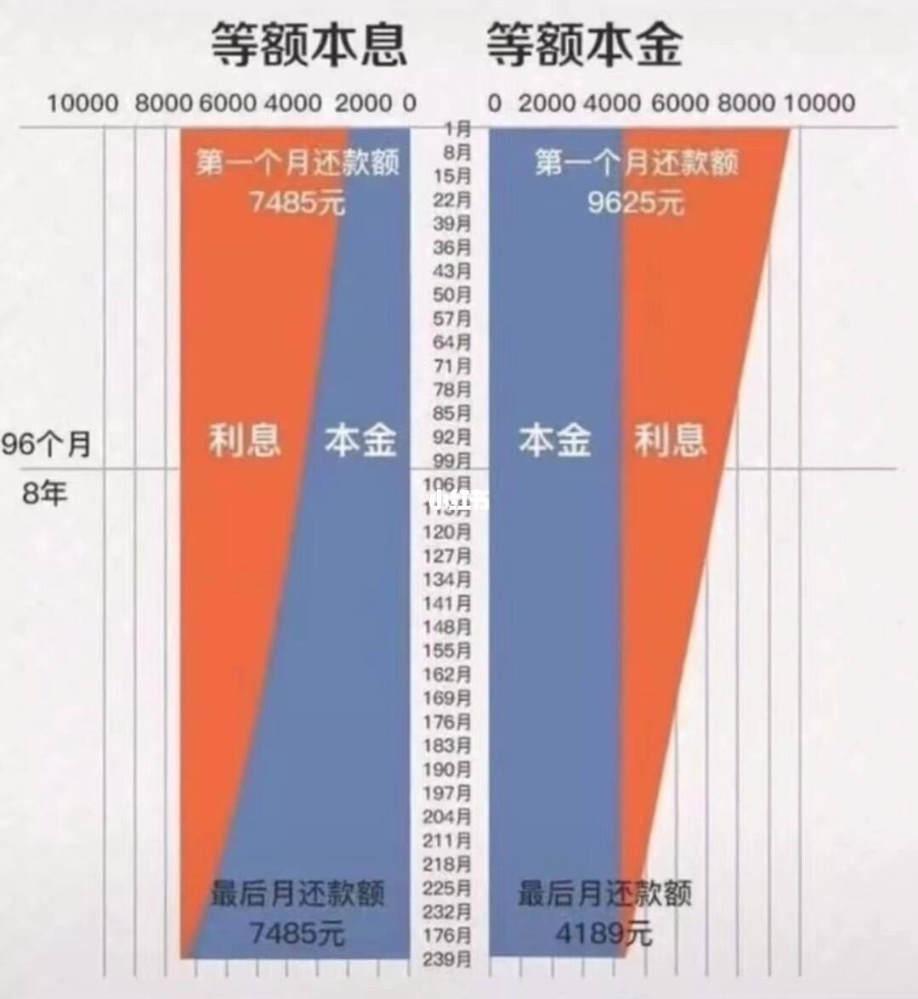

# 政策

<Adsense :data-ad-client=$themeConfig.ads.client :data-ad-slot=$themeConfig.ads.slot is-new-ads-code="yes" class="side-ads"></Adsense>

## 购房政策

杭州市政府一直落实“房住不炒”的中央精神，近几年也连续出台了调控政策，尤其是2021年8月5日发布的新政，大幅提高了买房门槛。如果你打算购房，都需要先判断自己是否符合购房政策。

### 限购政策

杭州市限购范围包括：西湖区、上城区、拱墅区、余杭区、滨江区、萧山区、临平区、富阳区、杭州经济技术开发区、杭州之江国家旅游度假区、大江东产业集聚区；临安区与桐庐、建德、淳安这些周边县市不限购。

在限购范围购房，无论是购买新房还是二手房，都要先符合购房条件才行，需要根据是否有杭州户籍两种情况判断。

#### 外地户籍

外地非杭州户籍必须同时满足以下两个条件：

- 在购房之日起前4年内**在限购区连续缴纳48个月**城镇社会保险或个人所得税(社保累计补缴不能超过3个月)。

- 名下在杭州市范围内无任何住房（非杭州的住房不计算，即非杭州户籍最多只能购买1套杭州住房）。

#### 杭州户籍

杭州户籍则要根据落户时长和落户地区进行判断：

- 落户在限购区满5年不受社保限制，未满5年则需要在购房之日起前2年内**在限购区连续缴纳24个月**城镇社会保险或个人所得税。

- 落户在非限购区未满2年没有购房资格，满2年也需要在购房之日起前2年内**在限购区连续缴纳24个月**城镇社会保险或个人所得税。

- 只有已婚家庭才能购买2套住房，其他情况均限购1套住房。限购套数是按家庭为单位共同计算的，即使房产为婚前财产，或者婚后想以公示形式购买个人房产，都会受到限购。

- 投靠子女落户的老人，需要满5年才有购房资格。

- 限购范围内住房赠与他人的，赠与人需满3年才能购买限购范围内住房；受赠人家庭须符合住房限购政策（不含遗赠）。

<InArticleAdsense :data-ad-client=$themeConfig.ads.client :data-ad-slot=$themeConfig.ads.inSlot is-new-ads-code="yes"></InArticleAdsense>

### 落户政策

如果你是非杭州户籍，并且社保或个税满2年但是不满4年，则短期内只能通过落户政策尽快获取购房资格，但是要注意办理落户需要在两地办理手续，并且一般需要等待几个月流程，如果只是差几个月社保就够4年则没必要折腾了。

目前杭州落户方式有：

- 应届毕业生落户：全日制普通高校本科及以上学历应届毕业生在当年12月31日前在杭州市区落实就业单位，与用人单位签订的一年以上的劳动(聘用)合同，并且缴纳社保1个月，即可申请落户人才中心或者单位集体户。

- 往届毕业生落户：全日制普通高校本科学历（45周岁以下不含45周岁），或者全日制普通高校硕士研究生学历（50周岁以下不含50周岁），或者全日制普通高校博士研究生学历（55周岁以下不含55周岁），与用人单位签订的一年以上的劳动(聘用)合同，并且缴纳社保1个月，即可申请落户人才中心或者单位集体户。

- 留学回国人员落户：赴国外攻读学历学位，或到国外高等院校、科研机构进修、做访问学者或博士后研究，但未在国(境)外入籍、定居的人员，原籍为中国，回国后在杭与用人单位签订的一年以上的劳动(聘用)合同，并且缴纳社保1个月，即可申请落户人才中心或者单位集体户。

- 技术职称落户：具有中级以上专业技术职务任职资格，年龄要求：中级45周岁以下，副高50周岁以下，正高职称55周岁以下，并且达到评审方要求：高级职称必须由省人事厅颁发，中级职称由市地人事局或省级部委办公厅颁发，并且已经连续缴纳1年以上的社保（不含补缴），提供与用人单位签订的一年以上的劳动(聘用)合同，即可申请落户人才中心或者单位集体户。

- 高技能人才落户：具有技师（二级技师）以上职业资格人员（45周岁以下不含45周岁），或者具有高级工职业资格人员（35周岁以下不含35周岁），上述两类人员需在杭州市区同一用人单位连续工作且由该单位缴纳社保满3年，目前仍在杭正常工作，持有在杭申领的有效[《浙江省居住证》](http://www.hangzhou.gov.cn/art/2019/5/23/art_1643250_4602.html)可以申请落户；另外获得高级职业资格证书的杭州市高级技工学校应届毕业生，在杭落实工作单位即可申请落户。

- 夫妻投靠落户：男女双方结婚满2年，一方在杭州市区有合法固定住所、且人户一致的，另一方持有在杭申领的有效[《浙江省居住证》](http://www.hangzhou.gov.cn/art/2019/5/23/art_1643250_4602.html)，可申请投靠落户。

- 父母投靠子女落户：男性年满60周岁，女性年满55周岁，并且外地身边无子女，子女全部或多数在杭州市区，被投靠子女在杭有合法固定住所、且人户一致，父母方持有在杭申领的有效[《浙江省居住证》](http://www.hangzhou.gov.cn/art/2019/5/23/art_1643250_4602.html)，可申请投靠落户。另外80周岁及以上老年人投靠在杭子女，不受“身边无子女”及[《浙江省居住证》](http://www.hangzhou.gov.cn/art/2019/5/23/art_1643250_4602.html)的条件限制，可自愿选择投靠在杭有合法固定住所处的子女。**但是需要注意，以父母投靠成年子女方式落户的，须满3年才能作为独立购房家庭在限购范围内购买**

- 积分落户：政府会每年定期3月或11月开放受理，申请者通过一系列指标的分值相加进行，最终达到政府公布的准落户分值即可落户（2020年的分值是120分），指标与分值具体参见[《杭州市居住证积分管理办法》](http://www.hangzhou.gov.cn/art/2021/1/13/art_1229063382_1717066.html)。

具体落户细节以及需要的材料，可以咨询户籍派出所或者人才中心，或者相关政策公告。

## 房贷政策

### 首付比例

限贷政策只针对名下是否有住房贷款记录而决定的，而住房贷款记录是全国联网的，因此即使你在外地购房有申请过房贷（不包含商住房贷款），不管是否已经还清，都会被限贷政策影响。

目前杭州规定名下无房贷记录最低首付为30%，名下有过1次房贷记录最低首付为60%，超过1次则必须全款购房。

需要注意，限贷政策和限购政策是互不干涉的，也就是说你就算外地购房并有房贷，但杭州市内无房，依然可以在杭州按首套房购买，只是购房必须提高首付比例。

### 公积金贷款

如想申请公积金贷款必须按规定正常足额缴存住房公积金，且在申请贷款时已连续缴存6个月（含）以上。

公积金贷款利率目前首套为3.25%（[利率查询页面](http://gjj.hangzhou.gov.cn/col/col1643235/index.html)），二套利率上浮1.1倍。每个人一生只能申请两次，而且第二次申请时必须在第一次贷款已经还清，且无不良记录。

杭州购房可选择使用杭州市公积金或者浙江省公积金，这要看你的工作单位缴存的是哪一种。

两种公积金的可贷额度，都是按公积金账户近12个月的月均余额（不含近12个月的一次性补缴），乘以15倍计算而来。可贷额度最低15万（即乘以15倍后不足15万按15万计算），个人最高50万，已婚家庭最高100万（夫妻各自计算后相加），可以通过支付宝城市服务或者浙里办查询。

异地公积金，申请方式有所区别和限制，具体请咨询**缴存地**的公积金中心。

<InArticleAdsense :data-ad-client=$themeConfig.ads.client :data-ad-slot=$themeConfig.ads.inSlot is-new-ads-code="yes"></InArticleAdsense>

### 商业贷款

公积金贷款毕竟额度太少，所以需要商业贷款进行补充。住房商业贷款是银行用其信贷资金所发放的自营性贷款，也就是我们通常说的"房贷"。商业贷款可以单独申请，也可以和公积金一起申请行成[组合贷](./#组合贷)。

从 2020 年 8 月开始，商业住房贷款利率都是按 `LPR 基准利率 + 上浮基点` 计算而来。

其中 LPR 利率是指央行发布的全国统一利率（[利率查询页面](https://www.boc.cn/fimarkets/lilv/fd32/201310/t20131031_2591219.html)），房贷一般都会大于5年，所以只关注5年期以上利率即可。央行会根据市场环境不定期进行调整，而且即使贷款已经批下来，还贷过程中的利率也会被 LRP 调整所影响。

上浮基点则是各地各家银行自行设定，并且只要贷款合同生效后则不再变化。因此当政策和放贷收紧时，一般上浮基点都会明显提高，以限制更多的房贷申请。另外一般首套房的上浮基点会更低一点。

:::tip 例如
最新的5年期以上 LPR 基准利率是 4.65%，在某银行申请房贷时约定上浮 45BP 利率，也就是上浮 0.45%，那实际房贷利率是 `LPR (4.65%) + 45BP (0.45%) = 5.1%`。
:::

通过商业贷款能贷多少钱，取决于银行对你还款能力的评判。通常的评判标准是你的月收入，银行会让你提供工作单位开具的工资证明、工资银行卡的流水等材料来进行审核。一般要求月收入必须大于每月还款额的2倍，也就是你想申请每月还1万元的贷款，必须提供每月2万元的收入证明（当然有些银行可能要求更高）。以夫妻名义买房可以提供双方材料按双方月收入之和。

### 组合贷

公积金贷款额度一般都不够用，可以和商业贷款一起形成组合贷的方式，但是必须通过支持组合贷的银行进行申请，具体哪些银行一般开发商的置业顾问或者房产中介会提供给你。

### 贷款期限

无论是商业贷款还是公积金贷款，贷款期限均最长不超过30年，并且贷款结束时的年龄男性不得超过65周岁，女性不得超过60周岁。

贷款都可以提前还清，但是几年内还清可能会产生违约金，因此要注意贷款时的合同约定。

### 还款方式

房贷提供了两种还款方式：等额本息和等额本金。

等额本息，是指每个月还款的本金+利息是等额的，但这也导致前面月份还款的金额里大部分都是利息。

等额本金，是指每个月还款的本金部分是等额的，利息是逐月递减的，但这也导致相同的贷款额度下前面月份的还款额更高。

下图是贷款 100 万并计划 20 年还清的比较：

两者的差异其实很好理解，即越早偿还更多的本金，才会让未偿还部分产生的利息更少。

虽然等额本金产生的总利息更少，但是前面月份需要偿还更多的金额，也意味着需要更强的还款能力才能被银行接受，所以要根据自身情况量力而行，相关个人建议请见[FAQ：等额本息vs等额本金](../faq/#等额本息vs等额本金)。

计算月供金额，可以通过很多银行和购房APP内置的房贷计算器，这里提供一款我觉得好用的：

[房贷计算器 - 房天下](https://newhouse.fang.com/house/tools.htm)
