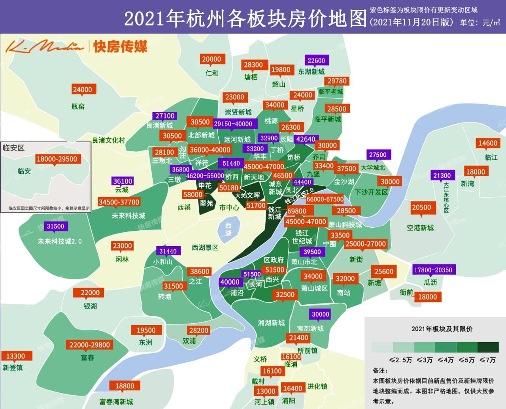

<Adsense :data-ad-client=$themeConfig.ads.client :data-ad-slot=$themeConfig.ads.slot is-new-ads-code="yes" class="side-ads"></Adsense>

# 购房

## 购置新房

### 摇号流程

目前杭州所有新建房源必须先由杭州住房保障和房产管理局发放预售证，然后通过公开登记与摇号公示的方式抽签认购，摇号是由杭州市国立公证处负责，因此最大限度保证了公平公正的原则。

摇号政策仅针对于限购区的新建商品住房，二手房依然是满足购房资格即可自由购买。

从登记摇号到选房的流程大致为：
1. 意向者在开发商发布登记日期内通过线上平台提交申请资料，报名后会进行资格审核，之后为每个家庭分配一个编号；
2. 公证处将所有编号随机排序，取前若干名的编号为中签者，其他为候补者，并且对中签者和候补者分别进行再次随机排序，这样每个人都有一个顺序号，决定选房的先后次序。
3. 在公证处指定时间进行线上操作选房，中签者按顺序选房，如果有剩余房源则顺延到候补者，直至完全选完。
4. 选房当时就要在线支付定金，并且在之后指定日期支付首付款并申请贷款手续。

这其中摇号环节还对不同家庭有一定的政策倾斜，目前包括[人才家庭倾斜](/#高层次人才)和[无房家庭倾斜](/#无房家庭)，房管局会对每次销售套数设定倾斜比例，专供于上述两类报名者优先摇号，其中人才倾斜是最高优先级。

> 例如某楼盘公示300套房源，其中人才倾斜20%即60套，无房家庭倾斜30%即90套，摇号过程如下：
> 1. 以人才身份报名的号码先随机排序，前60名成为中签者；
> 2. 以无房家庭的号码与上一轮落选者共同随机排序，前90名成为中签者；
> 3. 其他报名者与上一轮落选者共同随机排序，前150名成为中签者；
> 4. 前三轮中签者再次进行随机排序决定选房顺序，其他落选者随机排序决定候补选房顺序。

可以看出人才身份实际参与了三次摇号，而无房家庭也参与了两次摇号，因此概率上会有明显优势。

并且对于无房家庭还有一项特别照顾，如果公示价格低于35,000元/平方，则无房家庭倾斜比例固定为50%，其他比例则由相关部门审批决定。

<InArticleAdsense :data-ad-client=$themeConfig.ads.client :data-ad-slot=$themeConfig.ads.inSlot is-new-ads-code="yes"></InArticleAdsense>

### 高层次人才

人才资格认定需要通过杭州市人力资源和社会保障局申请，分为 A、B、C、D、E 类人才，申请标准由高到低，申请途径和认定标准见[《杭州市高层次人才分类目录》](https://rc.hzrs.hangzhou.gov.cn/articles/detail/6679.html)。

如果符合标准的话一定尽早申请，因为审批过程需要等待几个月时间。

但是需要注意，人才认定的同时还需要满足限购范围内无自有住房记录，或者转让房产后无自有住房记录满3年，才能以人才身份优先摇号。

### 无房家庭

认定为无房家庭比较简单，在满足购房资格的前提下，再满足以下两种条件之一：
1. 已婚并且夫妻双方名下无自有住房记录，即为无房家庭，如果在2018年4月4日后转让名下住房的需要满3年才能认定为无房家庭（日期之前的不受年限）。
2. 30周岁以上未婚单身且在杭州限购范围内无自有住房记录的购房人，和离异单身满3年且在杭州限购范围内无自有住房记录满3年的购房人，可认定为无房家庭。

认定无房家庭并不需要通过其他平台批准，只需在提交摇号资料时选择“无房家庭”并提供符合以上条件的资料即可。

### 准备资料

摇号需要准备的材料如下：
1. 身份证
2. 户籍证明（户口本首页、户主页、个人页）
3. 单身证明（楼盘公示时会提供模板）或者结婚证或者离婚证
4. 杭州住房查询证明（支付宝浙里办可查）
5. 征信报告（通过中国人民银行征信中心申请）
6. 社保或个税缴纳证明（社保支付宝浙里办可查，杭州户籍无需提供）
7. 冻资款（摇号需要在开发商指定银行冻结约等于首付的资金）
8. 其他身份还需要提供对应证明材料

需要注意，如果是已婚，必须是以家庭为单位共同报名，并且第1至5项材料需要夫妻双方均提供，其他材料只需主购房人提供。

### 拼社保

自2021年8月5日起，新建商品住房公开销售时，人才家庭、无房家庭、其他家庭这三类登记家庭数，如果与公示分配的房源数超过10倍，需要通过进行排序，再以10:1比例入围公证摇号，剩余家庭则无缘本次摇号。其中无房家庭、普通家庭分别按社保缴纳月数从多到少排序，高层次人才家庭先按B、C、D、E人才类别从高到低排序、同一类别人才再按社保缴纳月数从多到少排序。报名结束后，相关部门会对所有家庭的社保月数进行审核，划定符合比例的月数。

> 例如某楼盘公示300套房源，其中人才倾斜20%即60套，无房家庭倾斜30%即90套，其他家庭150套。截止报名结束，人才家庭报名数100户，无房家庭报名1000户，其他家庭报名2500户，最后相关部门认定无房家庭需要月数打到62个月，其他家庭95个月，最后人才家庭100户全部入围，无房家庭入围900户，其他家庭入围1510户（多出来的10户是由于月数相同共同入围）。

### 限价

政府对不同区块内的住宅用地出让时就已经限定了最高预售价格，这也是杭州购房者偏好于新房的主要原因，毕竟二手房无论如何上涨，都不会影响新房的限价，而且现阶段大部分新房限价都与周边二手房形成了价差，也就是所谓的“倒挂”。

### 限售

为了打击短期投机客，政府出台的还有限售政策。购买以下几种情况的新房，将被限制5年内无法进入市场转卖：
1. 以人才身份参加摇号购买的房源；
2. 购买综合中签率低于10%的房源（综合中签率=中签户数/报名总户数，由于存在相同月数入围的情况，依然可能低于10%）。

限售是以缴纳房产契税之日开始计算，而缴纳契税必须在交房之后，因此实际限售一般长达7~8年。

<InArticleAdsense :data-ad-client=$themeConfig.ads.client :data-ad-slot=$themeConfig.ads.inSlot is-new-ads-code="yes"></InArticleAdsense>

### 交付

目前杭州的新房源绝大部分都是预售的期房，交付一般需要等待2~3年左右，因此购买新房要考虑这其中的时间成本。

由于地块限价分为毛坯限价和精装修限价，绝大部分（其实是几乎全部）的开发商会以精装修交付，毕竟精装修标准是不透明的，这也导致同样价位的装修标准在不同楼盘有一定的“水份”，需要多加甄别。

## 购置二手房

购买二手房的前提也是需要先有购房资格，不过并不需要摇号等麻烦的方式，只需通过贝壳等平台筛选心仪的房源，然后联系对应的中介进行看房选房即可。只要和房东谈好价格达成交易意向，中介会帮你完成剩下的交易流程。

但是杭州对限购范围内的二手房交易，增值税征免年限已经调整为5年，而增值税为总房价的5.3%，并且一般会转嫁到买方，再加上1%~3%的中介费，以及其他费用，这些税费的额外支出不容小视，也变相提高了首付压力。

另外银行对二手房的放贷也有一定差异，一般二手房的贷款会限制得更严格，市场火热时银行也会对二手房进行减贷甚至停贷，这些因素都要提前了解。
